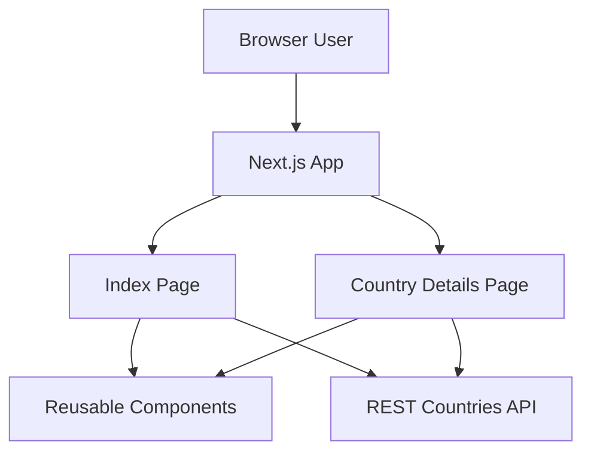
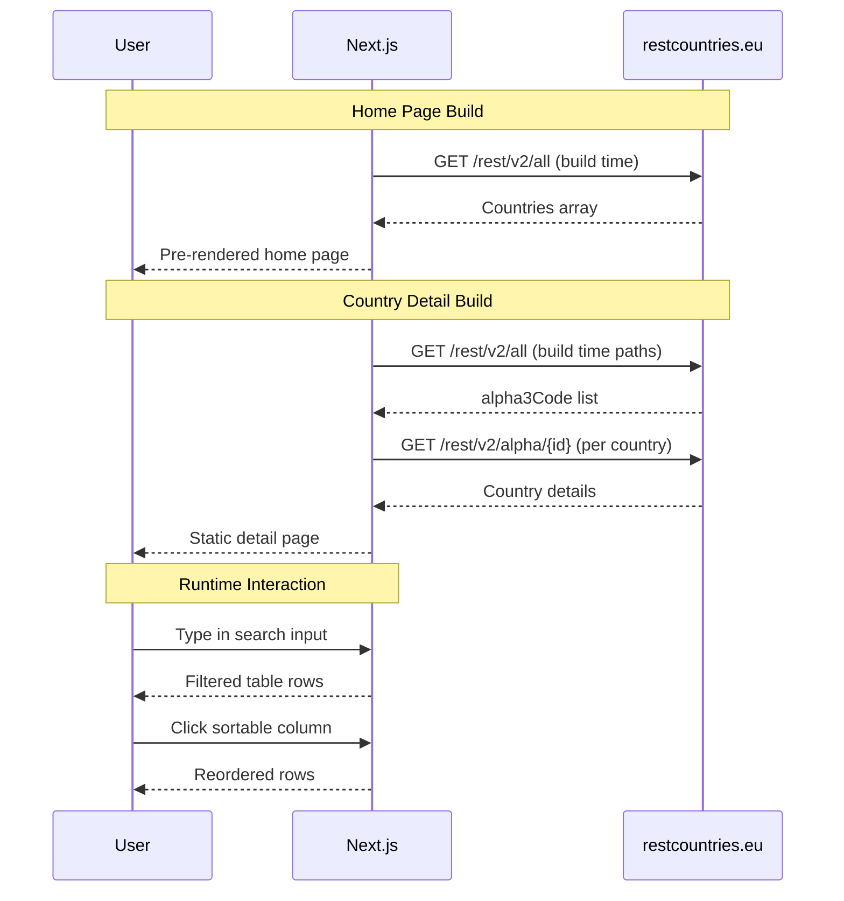

# Countries Ranks

A Next.js application that displays countries data, lets users filter by text, and view detailed country pages with bordering countries.

Built in February 2021. Inspired by Thu Nghiem's world ranks tutorial and project.

## Features

- List of all countries with flags, population, area, and Gini index
- Client-side filtering by country name, region, or subregion
- Sortable table columns (name, population, area, Gini)
- Dynamic country detail page (`/country/[id]`)
- Border countries preview on country details
- Light/dark theme toggle persisted in `localStorage`
- Static generation with Next.js `getStaticProps` / `getStaticPaths`

## Architecture Overview



## System Flow



## Getting Started

### Prerequisites

- Node.js 14+ (or any version compatible with Next.js 10)
- npm

### Installation

1. Clone the repository:
```bash
git clone https://github.com/orassayag/countries-ranks-github.git
cd countries-ranks-github
```

2. Install dependencies:
```bash
npm install
```

3. Run development server:
```bash
npm run dev
```

4. Open:
`http://localhost:3000`

## Available Scripts

### Development
```bash
npm run dev
```
Starts local development server.

### Production Build
```bash
npm run build
```
Builds optimized production output.

### Production Start
```bash
npm run start
```
Runs production server from built assets.

## Project Structure

```text
countries-ranks-github/
├── src/
│   ├── components/
│   │   ├── CountriesTable/
│   │   ├── Layout/
│   │   └── SearchInput/
│   ├── pages/
│   │   ├── country/
│   │   │   ├── [id].js
│   │   │   └── Country.module.css
│   │   ├── _app.js
│   │   └── index.js
│   └── styles/
│       ├── globals.css
│       └── Home.module.css
├── .github/
├── package.json
├── CONTRIBUTING.md
├── INSTRUCTIONS.md
└── README.md
```

## Data Source

The app currently fetches countries data from:

- `https://restcountries.eu/rest/v2/all`
- `https://restcountries.eu/rest/v2/alpha/{id}`

Note: if this API is unavailable, static generation may fail during build.

## Troubleshooting

### `npm install` fails
- Delete `node_modules` and `package-lock.json`, then run `npm install` again.

### Build fails while fetching countries
- Verify internet access.
- Confirm REST Countries endpoint availability.
- Retry `npm run build`.

### Theme does not persist
- Ensure browser allows `localStorage`.
- Check private/incognito restrictions.

## Contributing

Contributions are welcome. See [CONTRIBUTING.md](CONTRIBUTING.md) for contribution guidelines and [INSTRUCTIONS.md](INSTRUCTIONS.md) for setup and implementation notes.

## Credits

- Thu Nghiem tutorial: <https://www.youtube.com/watch?v=v8o9iJU5hEA>
- Original project inspiration: <https://github.com/nghiemthu/world-ranks>

## Author

- **Or Assayag** - [orassayag](https://github.com/orassayag)
- Or Assayag <orassayag@gmail.com>
- GitHub: <https://github.com/orassayag>
- StackOverflow: <https://stackoverflow.com/users/4442606/or-assayag?tab=profile>
- LinkedIn: <https://linkedin.com/in/orassayag>

## License

This project is licensed under the MIT License.