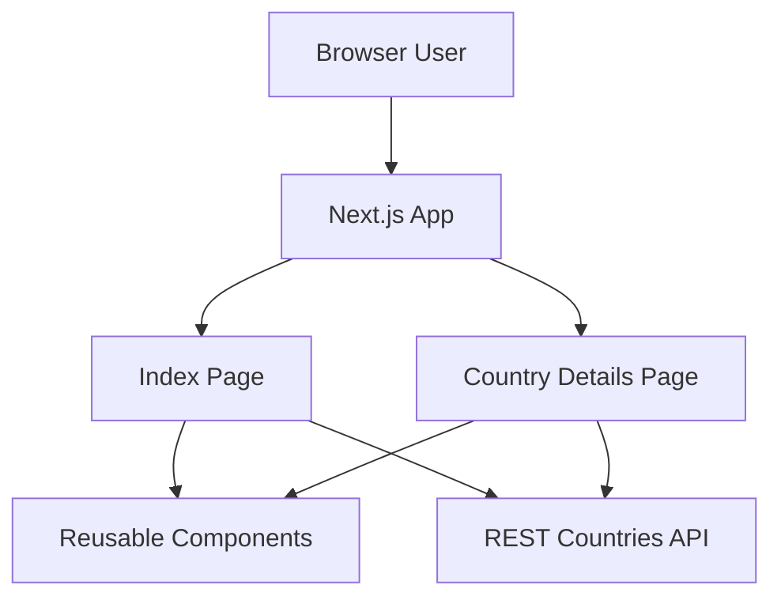
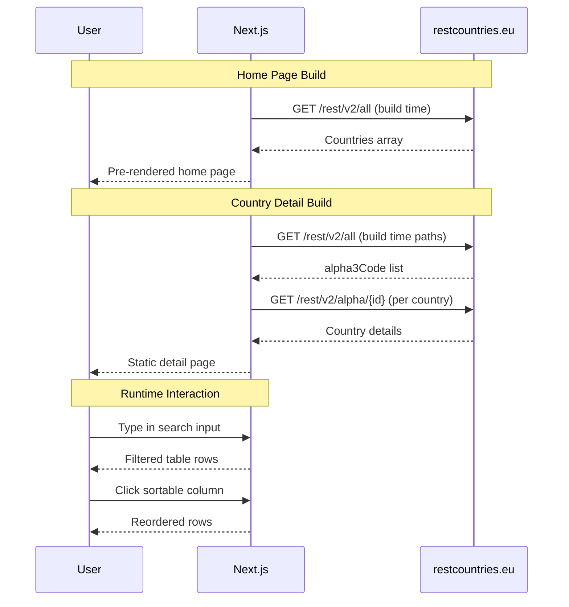

# Countries Ranks

A Next.js application that displays countries data, allows users to filter by text search, and view detailed country pages including bordering countries. It features responsive UI, dynamic routing, and efficient data fetching for smooth navigation across country information.Built in February 2021. Inspired by Thu Nghiem's world ranks tutorial and project. The project was created as a learning exercise to practice Next.js fundamentals, API integration, routing patterns, and building scalable frontend architecture with clean code structure.

## Features

- List of all countries with flags, population, area, and Gini index
- Client-side filtering by country name, region, or subregion
- Sortable table columns (name, population, area, Gini)
- Dynamic country detail page (`/country/[id]`)
- Border countries preview on country details
- Light/dark theme toggle persisted in `localStorage`
- Static generation with Next.js `getStaticProps` / `getStaticPaths`

## Architecture Overview



## System Flow



## Getting Started

### Prerequisites

- Node.js 14+ (or any version compatible with Next.js 10)
- npm

### Installation

1. Clone the repository:

```bash
git clone https://github.com/orassayag/countries-ranks-github.git
cd countries-ranks-github
```

2. Install dependencies:

```bash
npm install
```

3. Run development server:

```bash
npm run dev
```

4. Open:
   `http://localhost:3000`

## Available Scripts

### Development

```bash
npm run dev
```

Starts local development server.

### Production Build

```bash
npm run build
```

Builds optimized production output.

### Production Start

```bash
npm run start
```

Runs production server from built assets.

## Project Structure

```text
countries-ranks-github/
├── src/
│   ├── components/
│   │   ├── CountriesTable/
│   │   ├── Layout/
│   │   └── SearchInput/
│   ├── pages/
│   │   ├── country/
│   │   │   ├── [id].js
│   │   │   └── Country.module.css
│   │   ├── _app.js
│   │   └── index.js
│   └── styles/
│       ├── globals.css
│       └── Home.module.css
├── .github/
├── package.json
├── CONTRIBUTING.md
├── INSTRUCTIONS.md
└── README.md
```

## Data Source

The app currently fetches countries data from:

- `https://restcountries.eu/rest/v2/all`
- `https://restcountries.eu/rest/v2/alpha/{id}`

Note: if this API is unavailable, static generation may fail during build.

## Core Capabilities

- **Advanced Filtering**: Filter countries by name, region, or subregion in real-time.
- **Dynamic Sorting**: Multi-column sorting for population, area, and Gini index.
- **Detail Exploration**: Deep-dive into specific country data with border country navigation.
- **Theme Customization**: Persistent dark/light mode for user preference.

## Technical Excellence

- **Next.js Ecosystem**: Utilizing the power of Next.js for hybrid rendering.
- **Responsive UI**: Fully functional across mobile, tablet, and desktop.
- **Clean Code**: Adherence to modern JavaScript and React patterns.

## Developer Experience

- **Hot Reloading**: Instant feedback during development with Next.js.
- **Standardized Tooling**: ESLint and Prettier for code consistency.
- **Simple Deployment**: Optimized for Vercel or any static hosting provider.

## Usage

1. Browse the list of countries on the home page.
2. Use the search bar to find specific countries.
3. Click on table headers to sort the data.
4. Click on a country row to view its details and bordering countries.

## Architecture Principles

- **Component-Driven Development**: UI is built using small, isolated components in `src/components`.
- **Static Site Generation (SSG)**: Leveraging Next.js `getStaticProps` for optimal performance.
- **Client-Side Interactivity**: Filtering and sorting are handled efficiently on the client side.
- **Modular Styling**: CSS Modules are used to ensure style encapsulation.

## Best Practices

- **Performance**: Static generation ensures fast TTI (Time to Interactive).
- **Accessibility**: Semantic HTML and clear navigation patterns.
- **Maintainability**: Clear separation between components and page logic.
- **State Management**: Using React state for localized UI interactions (filtering/sorting).

## Design Patterns

- **Container/Presenter**: Pages act as containers fetching data, while components handle presentation.
- **Higher-Order Components/Hooks**: React patterns for shared logic.
- **SSG with Dynamic Routes**: Using `getStaticPaths` for generating country-specific pages.

## Configuration

The application connects to the REST Countries API. Configuration is primarily handled through the API endpoints defined in the page files:

- `https://restcountries.eu/rest/v2/all`
- `https://restcountries.eu/rest/v2/alpha/{id}`

## Directory Structure

```text
src/
├── components/     # Reusable UI components
├── pages/          # Next.js routes and data fetching
└── styles/         # Global and component-specific styles
```

## Support

For support, please open an issue on the GitHub repository or contact the author directly at orassayag@gmail.com.

## Troubleshooting

### `npm install` fails

- Delete `node_modules` and `package-lock.json`, then run `npm install` again.

### Build fails while fetching countries

- Verify internet access.
- Confirm REST Countries endpoint availability.
- Retry `npm run build`.

### Theme does not persist

- Ensure browser allows `localStorage`.
- Check private/incognito restrictions.

## Contributing

Contributions are welcome. See [CONTRIBUTING.md](CONTRIBUTING.md) for contribution guidelines and [INSTRUCTIONS.md](INSTRUCTIONS.md) for setup and implementation notes.

## Credits

- Thu Nghiem tutorial: <https://www.youtube.com/watch?v=v8o9iJU5hEA>
- Original project inspiration: <https://github.com/nghiemthu/world-ranks>

## Author

- **Or Assayag** - _Initial work_ - [orassayag](https://github.com/orassayag)
- Or Assayag <orassayag@gmail.com>
- GitHub: https://github.com/orassayag
- StackOverflow: https://stackoverflow.com/users/4442606/or-assayag?tab=profile
- LinkedIn: https://linkedin.com/in/orassayag

## License

This application has an MIT license - see the [LICENSE](LICENSE) file for details.

## Acknowledgments

- Built for educational and research purposes
- Respects robots.txt and implements rate limiting
- Uses user-agent rotation to avoid detection
- Implements polite crawling practices
